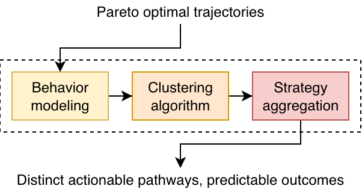

# TRACE: Trajectory-based Clustering for Explainability
Developed at Vrije Universiteit Brussel (VUB) as part of the FWO-SBO project ANTICIPATE, in collaboration with
University of Antwerp (UA) and Universitair Ziekenhuis Brussel (UZBrussel).

**Dependencies:** Python 3.11<br>
**Contact:** Emily Palaska (emily.palaska@vub.be)<br>
**License:** Apache 2.0

<p align="center">
  
  
  
  
</p>


## ⚡ Quickstart
Clone this repository with `git clone https://github.com/emily-palaska/trace`<br>
Install requirements with `pip install -r requirements.txt`<br>


## ⚙️ Example of usage

```python

# todo

```

## 🧠 About
TRACE analyzes pareto-optimal trajectories collected SOTA MORl algorithms and clusters them to create discrete decisive
strategies in an effort to translate complex stochastic Pareto fronts to policymakers. It consists of five modules:
- **behavior**: bayesian conditioning, distance features, similarity network, statistics reports
- **clustering**: k-means, k-medoids, gaussian/dirichlet mixture models, spectral
- **core**: data flow management, auxiliary simulation methods, ground truth pareto front algorithms
- **morl_baselines**: code files adapted from the public repository [morl-baselines](https://github.com/LucasAlegre/morl-baselines) with minimal to support trajectory tracking. Credits are due to the original creators of each morl method.
- **visuals**: plotting functions mainly to identify patterns from the formed clusters

An abstracted high-level flow chart of the mechanism:
<p align=center>  

## 💭 Behavior Modeling

todo: pic of four plots from report


## Agreement and decisiveness

todo: explain and minimal mathematical formulas