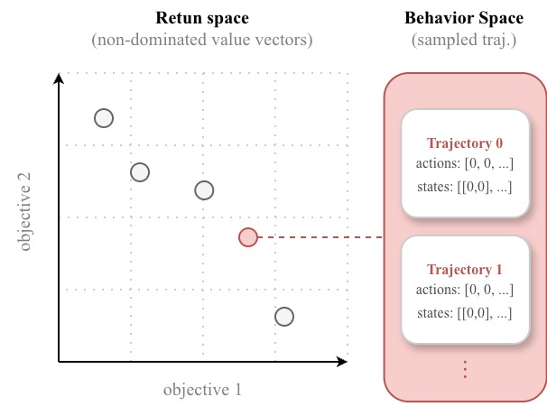
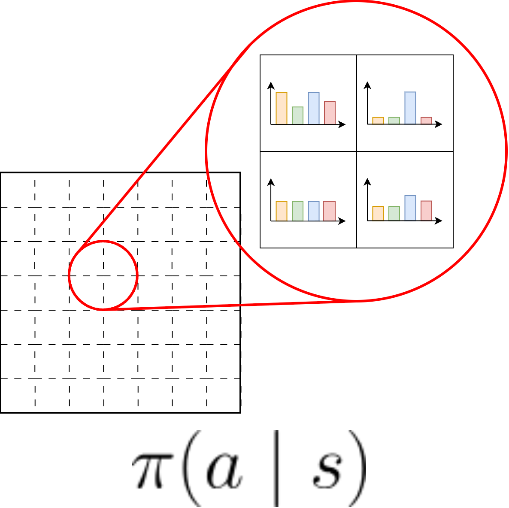

# TRACE: Trajectory-based Clustering for Explaining Multi-Objective Reinforcement Learning
Developed at Vrije Universiteit Brussel (VUB) as part of the FWO-SBO project ANTICIPATE.

**Paper:** [Multi-Objective Decision Making Workshop @ IJCAI-ECAI 2026]<br>
**Dependencies:** Python 3.11<br>
**Contact:** Emily Palaska (emily.palaska@vub.be)<br>
**License:** GNU General Public License v3.0

<p align="center">
  
  
  
  
</p>


## ⚡ Quickstart
Clone this repository with `git clone https://github.com/emily-palaska/trace`<br>
Install requirements with `pip install -r requirements.txt`<br>


## ⚙️ Example of usage

```python
import numpy as np
from trace.core import TrajectoryManager
from trace.behavior import EmpiricalDistribution, distance_matrix, quantize
from trace.clustering import k_medoids
from trace.visuals import temporal_alignment, grid_trajectories

# Trajectory loading (precomputed)
manager = TrajectoryManager('minetrain').load('ground_truth', pareto=True)

# Behavior features
obs, acs, rew = manager.conditioning_features()
quantize(obs, method='eq', bins=[10, 10, 6, 10, 10, 90, 90])
models = [EmpiricalDistribution(manager.metadata).fit(o, a) for o, a in zip(obs, acs)]
features = distance_matrix(models, metric='kl')

# Clustering algorithm
k = 5
labels = k_medoids(features, k=k)
clusters = [manager.subset(np.array(labels) == l) for l in range(k)]

# Intuitive plots
for c, cluster in enumerate(clusters):
    temporal_alignment(cluster, title=f'Cluster {c}').show()
    grid_trajectories(cluster, title=f'Cluster {c}').show()

```

## 🧠 About
TRACE analyzes pareto-optimal trajectories collected by SOTA MORl policies and ground truth algorithms with the goal of
clustering them based in their behavior. The produced groups of trajectories are presented through interpretable
explanations and graphs. In this way, TRACE manages to summarize large amounts of trajectory data into intuitive
strategy insights for decision makers. It consists of five modules:
- **behavior**: empirical conditioning, behavior modeling and distance features
- **clustering**: k-means, k-medoids, gaussian/dirichlet mixture models, spectral
- **core**: data flow management, mathematical methods
- **policies**: SOTA MORL methods, ground truth algorithms and modified environments. 
- **visuals**: plotting functions mainly to identify patterns from the formed clusters

Note: minimally adapted code files from the public repository [morl-baselines](https://github.com/LucasAlegre/morl-baselines)
can be found in the module `trace.policies`, with modifications concerning trajectory tracking. Credits are due to the
original creators of each MORL algorithm.

An abstract high-level flow chart of the mechanism:
<p align="center">
    
    
</p>

## 💭 Behavior Modeling

To derive valuable behavior features for clustering, we first quantize the state space to have equal values per bin.
Then, to incorporate state-dependent structure into the
behavioral representation, we condition actions on the states in which they are performed. Finally, we compare two 
trajectories using the kl divergence on their common (quantized) state's empirical distributions.

<p align="center">  </p>
